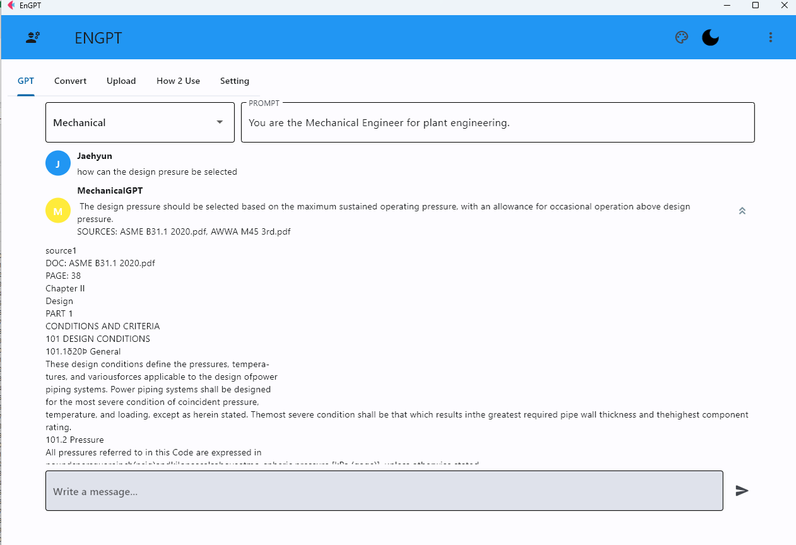
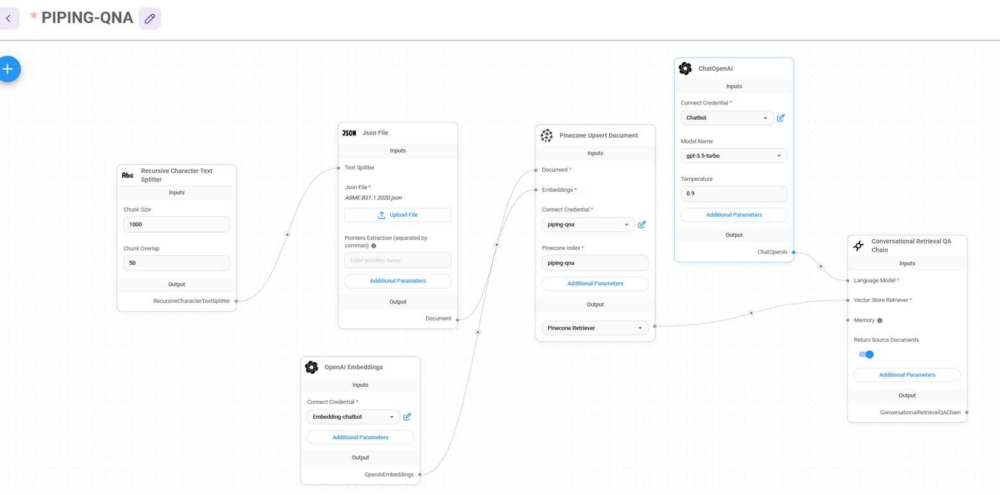

openai_faiss_chat.main.py

# gpt-docs-chatbot-python
gpt-docs-chatbot-python by using FAISS/openai on flet

This guide is about the implementation of 'gpt-docs-chatbot-python' using FAISS and Flet.

Result and source is shown as per map reduce method

1. Setting up the API Key
Begin by configuring your Pinecone API Key to enable API access.

2. Converting Documents to FAISS DB
Retrieve documents and transform the necessary information into JSON format. This step seems to involve the use of FAISS or Flet.

3. MERGE FAISS DB
Upload the converted JSON data to Pinecone to store it in a searchable format.

4. Chatting
Once the setup is complete, the document chatbot responds to user queries based on the stored data.

To make things easier, consider modularizing the implementation, especially if you're a beginner. Here's a suggested breakdown of the modules:

By dividing the work into these smaller modules, it will be much more manageable to make modifications. If you're new to this, taking these steps gradually can help you learn effectively.

